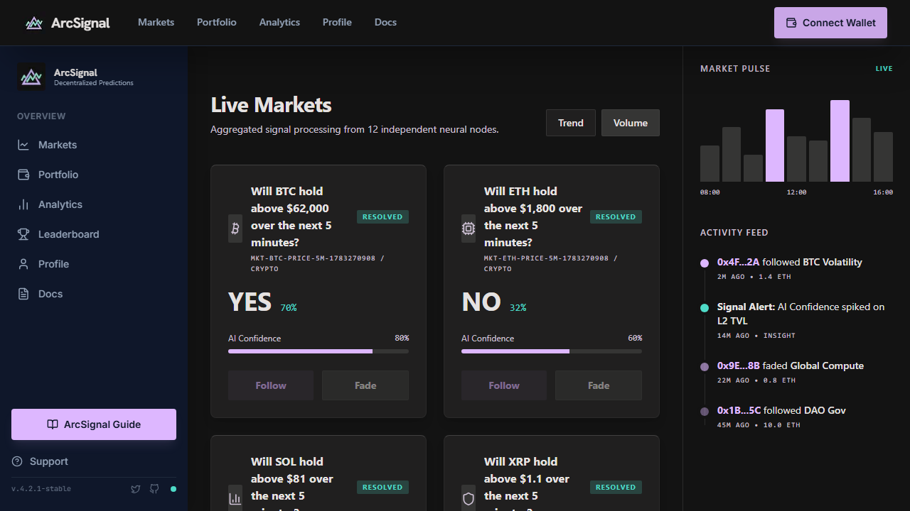

# ArcSignal

USDC prediction markets on ARC Testnet. Traders take a **Follow** or **Fade**
position, and resolved pools settle pari-mutually on-chain.

- Production: [arc-signal.xyz](https://arc-signal.xyz)
- Network: ARC Testnet (`5042002`); native currency is USDC
- ArcSignal contract: `0x4f33115a18fe6a181be98610ddde3fab71efabed`
- Testnet USDC: `0x3600000000000000000000000000000000000000`

> Testnet software. The contracts are unaudited and must not be used with
> real-value funds.



## Documentation

- [Protocol and application guide](DOCS.md)
- [Whitepaper](WHITEPAPER.md)
- [Privacy policy](PRIVACY.md)
- [Terms](TERMS.md)
- [Operations and maintenance scripts](scripts/README.md)

## Current capabilities

- AI-generated crypto and football market theses
- On-chain Follow/Fade staking with USDC
- Pool-derived payout estimates with no deployed-contract trading fee
- On-chain user profiles and transaction verification
- Indexed Neon data with a bounded 60-market ARC Multicall fallback
- Authenticated generation, resolution, maintenance, and indexing routes
- Responsive market, portfolio, leaderboard, feed, and analytics interfaces

Market generation and resolution are currently owner-controlled testnet
operations. Decentralized resolution and ARC Mainnet support are roadmap items,
not current production claims.

## Repository layout

```text
.
├── .github/workflows/       # CI and indexer workflows
├── db/schema.sql            # PostgreSQL/Neon schema
├── lib/                     # Foundry dependencies
├── public/                  # Runtime images and screenshots
├── scripts/
│   ├── diagnostics/         # Read-only ARC diagnostics
│   ├── operations/          # Operational checks
│   ├── deploy/legacy/       # Manual recovery deployment helpers
│   └── README.md            # Script usage and safety notes
├── src/
│   ├── app/                 # Next.js pages and API routes
│   ├── components/          # Shared React components
│   ├── contracts/           # ArcSignal Solidity source
│   ├── hooks/               # Client hooks
│   ├── lib/                 # Chain, data, and domain logic
│   └── __tests__/           # Vitest regression tests
└── test/                    # Foundry contract tests
```

Generated directories such as `.next/`, `out/`, caches, logs, and
`node_modules/` are intentionally excluded from Git.

## Local development

Requirements:

- Node.js 20 or newer
- npm
- Foundry when running Solidity tests

```bash
git clone https://github.com/syther069/ArcSignal-.git
cd ArcSignal-
npm install
cp .env.example .env.local
npm run dev
```

Configure only the variables required for the flow you are running. Never
commit private keys, tokens, wallet files, or populated environment files.

## Verification

```bash
npx tsc --noEmit
npm test
npm run lint
npm run build
npm run check:bundles
npm run audit:baseline
forge test
```

The production dependency audit uses a checked baseline so new vulnerabilities
fail CI without misrepresenting existing advisories as resolved.

## Data and transaction integrity

- ARC RPC receipts and matching ArcSignal events are authoritative for
  transaction confirmation.
- External testnet explorers are not treated as proof.
- Neon is the preferred indexed source.
- When Neon is unavailable, public reads use bounded ARC snapshots rather than
  unbounded log scans or per-market RPC storms.
- Empty, incomplete, and unavailable data states are reported explicitly; the
  application does not fabricate positions, history, rankings, or receipts.

## License and ownership

Copyright belongs to the ArcSignal project contributors. No open-source license
is granted unless a license file is added explicitly.