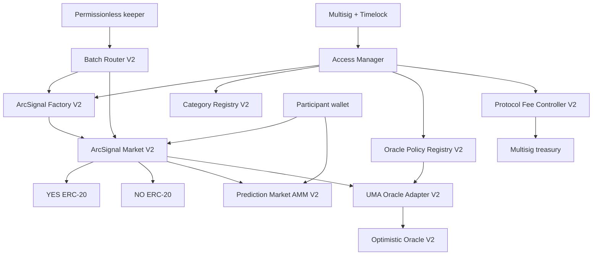

# ArcSignal V2 Implementation Plan

## Purpose and release boundary

ArcSignal V2 will replace new-market creation on the current owner-resolved pari-mutuel contract with a versioned, auditable protocol architecture aligned with the official Arc prediction-market reference: collateral-backed binary positions, explicit lifecycle state, optimistic resolution, reliable event indexing, and USDC settlement.[^1][^2][^3]

V2 will be developed and rehearsed on Arc Testnet. “Mainnet-ready” in this plan means the source, architecture, configuration system, tests, operational controls, migration path, monitoring, documentation, and independent reviews are ready to accept official mainnet parameters. It does not mean mainnet deployment is currently possible. Arc's current official deployment guide describes Arc as testnet, and the official contract-address reference says mainnet addresses are not yet available.[^4][^5] No mainnet chain ID, RPC, USDC address, CCTP domain, oracle address, or explorer URL will be guessed.

The V1 contract will remain immutable and accessible for existing positions and claims. V2 will be a separate deployment. No V1 collateral or user position will be automatically moved.

## Required-capability traceability

| Required capability | Planned implementation | Acceptance evidence |
|---|---|---|
| Versioned market and oracle policies | Independent protocol, category, oracle-policy, and metadata schema versions fixed per market | Market getter, creation event, manifest, and UI show identical versions |
| Category identifiers | `uint32 CategoryId` plus append-only versioned registry | Unregistered/inactive categories revert; existing versions remain queryable |
| Resolution-source commitments | On-chain source, terms, ancillary-data, and rules hashes plus content-addressed URI | Retrieved document hashes match the market and creation event |
| OPEN/CLOSED/RESOLVED/VOIDED | Explicit `MarketState` with monotonic transitions and separate oracle substate | Unit/invariant tests and indexed lifecycle timeline |
| Dispute/delayed-resolution windows | Committed close, request, proposal liveness, arbitration, grace, and void deadlines | No early settlement; permissionless dispute and expiry/void tests |
| Role-based creation and resolution | Creator/policy/admin roles; resolution maintenance is permissionless and keepers cannot choose outcomes | Access tests prove no role can directly set YES/NO |
| Emergency pause | Granular creation/mint/swap pause while settlement, refunds, and redemption remain open | Incident tests and public pause-state events |
| Fees and treasury | Immutable caps, per-market fee snapshot, timelocked changes, multisig treasury, pull withdrawals | Accounting invariants and transparent fee events/UI |
| Stronger indexing events | Versioned, indexed events for every asset and state transition | Empty-database replay reconstructs state without routine per-market reads |
| Batch creation/resolution | Atomic bounded creation; best-effort permissionless request/settle/sync batches | Gas bounds, per-item result events, and partial-failure tests |

## Product decisions fixed by this plan

1. V2 uses real USDC as collateral through Arc's ERC-20 interface. Arc's native and ERC-20 USDC interfaces share an underlying balance, but native gas and ERC-20 amounts can expose different precision conventions; all protocol accounting will use the ERC-20 interface and query `decimals()` during deployment verification.[^5][^6]
2. V2 exposes transferable ERC-20 YES and NO position tokens for each market and a constant-product AMM, following the Arc sample's market model.[^2][^3]
3. The current Follow/Fade product language maps to YES/NO positions: Follow means taking the side of the published AI thesis; Fade means taking the opposite side. The contract settles the objective YES/NO question. The mapping between thesis prediction and Follow/Fade is committed when the market is created.
4. AI analysis is advisory. It can never resolve a market or bypass the oracle.
5. Normal resolution is optimistic and permissionless. No privileged “resolver” role can directly set YES or NO.
6. A disputed outcome must reach a production-grade arbitration mechanism. The Arc sample's `MockOracleAncillary` may be used only in labeled testnet environments and cannot satisfy the mainnet gate.[^3]
7. Markets and user assets are immutable after creation. Governance can register future implementations and policies, but cannot rewrite terms, fees, liveness, sources, or settlement rules for an existing market.
8. Pausing may stop new exposure and trading. It must not block oracle settlement, void refunds, or valid redemptions.
9. Protocol fees are capped on-chain and changes are timelocked. No hidden or mutable per-market fee can be introduced after trading starts.
10. Every material state transition emits enough indexed event data to reconstruct protocol state from genesis.

## Target contract architecture



The registry and factory define what may be created. Each market then owns immutable terms and isolated collateral. Oracle callbacks can change only the market tied to the exact request key. The batch router improves operations without becoming a custody or outcome authority.

### `ArcSignalFactoryV2`

The factory is the canonical entry point for market creation and protocol-version discovery.

Responsibilities:

- register approved market, outcome-token, AMM, and oracle-adapter implementation versions;
- create deterministic minimal-proxy instances using `CREATE2` salts;
- enforce category, oracle-policy, timing, collateral, fee, and metadata constraints;
- maintain the canonical mapping from `marketId` to market address and protocol version;
- expose bounded `createMarketsBatch`;
- emit a complete `MarketCreatedV2` event;
- reject duplicate IDs and implementation versions that are disabled for new creation.

The factory will not custody market collateral. Existing implementations can be deprecated for new markets without changing already-created markets.

### `ArcSignalMarketV2`

Each market stores immutable initialized terms and owns its collateral and YES/NO mint/redeem logic.

Required market state:

```solidity
enum MarketState { OPEN, CLOSED, RESOLVED, VOIDED }
enum OracleState { NONE, REQUESTED, PROPOSED, DISPUTED, SETTLED }
enum BinaryOutcome { UNSET, YES, NO, UNDETERMINED }
```

`MarketState` is the user-facing lifecycle. `OracleState` exposes the optimistic-resolution substate without weakening the four required top-level states.

State transitions:

```text
OPEN --close time--> CLOSED
CLOSED --oracle request--> CLOSED / REQUESTED
REQUESTED --proposal--> CLOSED / PROPOSED
PROPOSED --dispute--> CLOSED / DISPUTED
PROPOSED --liveness expires, settle--> RESOLVED
DISPUTED --arbitration result, settle--> RESOLVED or VOIDED
CLOSED --request/proposal/grace deadline failure--> VOIDED
OPEN --strict emergency condition before exposure, or governance-approved invalid terms--> VOIDED
```

Rules:

- time-derived closure is permissionless through `syncState()` and is also enforced inside every state-changing function;
- positions cannot be minted or traded at or after `closeTime`;
- resolution cannot occur before the committed close time and oracle process;
- an undetermined oracle result voids the market and permits pro-rata collateral redemption;
- a market with no valid proposal by `voidAfter` can be permissionlessly voided;
- a direct administrator outcome setter does not exist;
- all external transfers use `SafeERC20`, checks-effects-interactions, and reentrancy protection.

### `OutcomeTokenV2`

Each market has two standard ERC-20 tokens:

- YES token;
- NO token.

Only its market can mint and burn. Token names and symbols include a short market identifier, while the full canonical market ID remains in the market/factory. The token contracts are minimal clones of a locked implementation and use fixed decimals matching the collateral accounting unit.

Users deposit one unit of USDC to mint one YES plus one NO token. Before final settlement, equal YES/NO pairs can be burned to recover one unit of collateral. After settlement, winning positions redeem according to the final payout vector. An undetermined/void result returns equal pro-rata value to both sides, subject to conservation and rounding rules defined in tests.

### `PredictionMarketAMMV2`

Each market receives an optional constant-product AMM instance aligned with the Arc sample.

Responsibilities:

- hold YES and NO reserves;
- buy and sell either side using `x*y=k` calculations;
- expose exact preview functions for every trade path;
- enforce user-supplied minimum output and deadline;
- account for protocol and liquidity fees separately;
- prevent trading after market close;
- allow settlement/redemption of AMM inventory after resolution;
- emit reserve, amount-in, amount-out, fee, recipient, and market identifiers on every swap.

V2 will not seed every market blindly. A market is activated only after minimum two-sided liquidity is deposited. The initial liquidity provider receives explicit LP shares or another reviewed ownership representation. LP withdrawal and post-resolution settlement rules must be fully specified before implementation.

### `CategoryRegistryV2`

Categories use stable identifiers instead of unrestricted strings.

Proposed representation:

```solidity
type CategoryId is uint32;

struct CategoryVersion {
    bytes32 nameHash;
    bytes32 schemaHash;
    string metadataURI;
    bool activeForNewMarkets;
}
```

The registry assigns IDs rather than deriving security decisions from display text. Each market stores `categoryId` and `categoryVersion`. Category metadata includes display name, description, icon key, permitted question schema, permitted oracle policies, minimum/maximum duration, evidence requirements, and jurisdictional availability metadata. The on-chain `schemaHash` commits to the canonical category rules document.

Initial IDs should cover Crypto and Football. New categories such as Politics, Economics, Technology, Esports, or Entertainment require a new registry entry, resolution-policy review, source-quality review, and category-specific integration tests. Deactivating a category prevents new creation and does not modify existing markets.

### `OraclePolicyRegistryV2`

Oracle rules are registered and versioned before a market references them.

```solidity
type OraclePolicyId is uint32;

struct OraclePolicyVersion {
    address adapter;
    address oracle;
    address bondCurrency;
    bytes32 identifier;
    uint64 minLiveness;
    uint64 maxLiveness;
    uint128 minBond;
    bytes32 rulesHash;
    string rulesURI;
    bool activeForNewMarkets;
}
```

Each market commits to:

- policy ID and policy version;
- adapter and oracle addresses resolved at creation;
- exact identifier;
- liveness duration;
- proposer bond and reward;
- resolution-source hash;
- ancillary-data hash;
- rules hash and metadata URI;
- request, proposal, dispute, settlement, and void deadlines.

The registry enforces minimum liveness and bond values but cannot alter a live market's stored parameters. Policy updates create a new version. Old versions remain queryable forever.

### `UMAOracleAdapterV2`

The first adapter follows the event-based UMA OOv2 request pattern used by the official Arc sample and UMA's event-based tutorial: `requestPrice`, custom liveness, custom bond, event-based mode, proposal, dispute, and settlement callbacks.[^3][^7]

The adapter must:

- bind callbacks to the exact market, identifier, timestamp, ancillary data, and oracle address;
- accept only YES, NO, or UNDETERMINED values;
- reject unsolicited or replayed callbacks;
- store the request key and final settlement evidence;
- support permissionless request/propose/dispute/settle entry points where the upstream oracle permits;
- expose current proposal, proposer, disputer, bond, expiration, and final price;
- make repeated calls idempotent;
- never let the factory admin substitute a result.

Before production deployment, the team must verify that the intended UMA contracts and a real arbitration/DVM path officially support the target Arc mainnet. If they do not, V2 mainnet launch remains blocked or must use a separately reviewed cross-chain oracle design. Deploying the Arc sample's mock oracle infrastructure does not satisfy this requirement.

### `BatchRouterV2`

Batch operations are isolated from custody contracts.

Required methods:

- `createMarketsBatch(CreateMarketParams[] calldata)` with a hard item limit;
- `requestResolutionBatch(address[] calldata markets)`;
- `settleMarketsBatch(address[] calldata markets)`;
- `syncStatesBatch(address[] calldata markets)`;
- optional `redeemBatch(Redemption[] calldata)` for a single user.

Creation is atomic: any invalid item reverts the batch so a deployment manifest cannot be partially applied. Permissionless maintenance batches use per-item `try/catch`, emit `BatchItemSucceeded` or `BatchItemFailed`, and never hide failures. Limits are established from measured Arc Testnet gas and calldata bounds, not arbitrary assumptions. The frontend/API chunks larger requests.

### `ProtocolFeeControllerV2`

Fee policy is explicit and capped.

Initial fee surfaces:

- market-creation fee, optionally zero;
- AMM swap protocol fee;
- AMM liquidity-provider fee;
- no redemption fee in the initial release;
- no fee on void refunds;
- oracle bond/reward displayed separately from protocol revenue.

On-chain controls:

- immutable maximum fee caps;
- fee changes only through a timelock;
- market stores the fee version and effective fee parameters at creation;
- treasury must be a multisig, never an EOA hot key;
- pull-based accrued fee withdrawal;
- `FeesAccrued` and `FeesWithdrawn` events;
- zero-address and USDC-only validation;
- two-step treasury change with timelock and cancellation.

Fee accounting must preserve collateral solvency. Oracle bonds and rewards cannot be taken from participant collateral.

## Versioning model

V2 needs four independent version axes:

| Version | Purpose | Mutability |
|---|---|---|
| `protocolVersion` | Factory/market/token/AMM implementation bundle | Fixed per market |
| `categoryVersion` | Category schema and evidence requirements | Fixed per market |
| `oraclePolicyVersion` | Oracle, adapter, bonds, liveness and rules | Fixed per market |
| `metadataSchemaVersion` | Canonical off-chain JSON/IPFS format | Fixed per market |

No proxy upgrade may change a live market's asset logic. New audited implementations are registered under a new protocol version. The frontend and indexer resolve behavior from versioned deployment manifests and never infer it from a single global ABI.

Every release manifest contains:

- source commit;
- compiler and optimizer settings;
- implementation and factory addresses;
- constructor/initializer arguments;
- bytecode and ABI hashes;
- category and policy registry snapshots;
- chain ID and genesis/network name;
- USDC, oracle, CCTP, and treasury addresses;
- deployment transaction hashes and block numbers;
- explorer/source-verification URLs;
- audit report hashes;
- smoke-test results.

## Resolution-source commitments

Market terms will be canonicalized off-chain and committed on-chain.

```json
{
  "schemaVersion": 1,
  "question": "...",
  "categoryId": 1,
  "closeTime": 0,
  "resolutionRules": "...",
  "primarySource": {
    "provider": "...",
    "endpointTemplate": "...",
    "fieldPath": "...",
    "observationWindow": "..."
  },
  "fallbackRules": "...",
  "invalidOrUnavailableRule": "VOID",
  "timezone": "UTC"
}
```

The factory receives the canonical `termsHash`, `resolutionSourceHash`, `ancillaryDataHash`, and content-addressed `metadataURI`. Creation re-computes or verifies the expected commitment format. Events include these values. The app stores and serves the exact committed document and verifies its hash before display.

Mutable URLs alone are insufficient. Production metadata should use a content-addressed URI such as IPFS/Arweave plus mirrored HTTPS retrieval. Source terms must define how edits, API outages, corrections, postponed events, ties, cancellations, and ambiguous observations resolve.

## Roles and governance

Use OpenZeppelin `AccessManager` or an equivalently reviewed role/timelock design.

| Role | Authority | Production holder |
|---|---|---|
| Default admin | Configure role administration only | Timelock controlled by multisig |
| Protocol registrar | Register new audited implementation versions | Timelock |
| Category policy admin | Add/deactivate category versions | Timelock |
| Oracle policy admin | Add/deactivate oracle-policy versions | Timelock |
| Market creator | Create markets from approved policies | Restricted service wallet initially; broader governance later |
| Pauser | Pause creation, minting and trading | Small emergency multisig/security council |
| Treasury admin | Propose treasury/fee changes | Timelock |
| Keeper | Optional automation convenience | Cannot choose outcomes; permissionless functions remain callable by anyone |

There is deliberately no role with arbitrary balance withdrawal, term editing, user-position seizure, or direct outcome selection.

Administrative changes emit old/new values, caller, execution timestamp, and proposal/timelock identifiers. High-impact changes have a minimum delay and cancellation window. Emergency pause actions emit a machine-readable reason hash and scope.

## Emergency controls

Pause scopes are granular:

- global new-market creation;
- new mint/deposit;
- AMM swaps;
- individual compromised market;
- optional bridge/onboarding UI kill switch off-chain.

The following remain available while paused:

- close/sync state;
- oracle proposal, dispute, and settlement when safe;
- void finalization;
- pair redemption;
- winning-token redemption;
- void refunds;
- read functions.

Unpausing requires a multisig and, after a severe incident, a timelock. An individual market can be voided administratively only under narrowly defined pre-resolution conditions committed in policy; once a valid oracle result is final, governance cannot replace it.

## Strong event schema

Events must support deterministic, idempotent indexing without per-market RPC reads.

Minimum events:

```solidity
event ProtocolVersionRegistered(uint32 indexed version, address marketImpl, address tokenImpl, address ammImpl, bytes32 bundleHash);
event CategoryVersionRegistered(uint32 indexed categoryId, uint32 indexed version, bytes32 schemaHash, string metadataURI);
event OraclePolicyVersionRegistered(uint32 indexed policyId, uint32 indexed version, address indexed adapter, address oracle, bytes32 rulesHash);
event MarketCreatedV2(bytes32 indexed marketId, address indexed market, uint32 indexed protocolVersion, uint32 categoryId, uint32 categoryVersion, uint32 policyId, uint32 policyVersion, address yesToken, address noToken, address amm, address collateral, uint64 closeTime, bytes32 termsHash, bytes32 resolutionSourceHash, string metadataURI);
event MarketStateChanged(bytes32 indexed marketId, MarketState previousState, MarketState newState, uint64 timestamp, bytes32 reasonHash);
event PositionsMinted(bytes32 indexed marketId, address indexed payer, address indexed recipient, uint256 collateralIn, uint256 yesMinted, uint256 noMinted);
event PairsRedeemed(bytes32 indexed marketId, address indexed account, uint256 pairsBurned, uint256 collateralOut);
event Swap(bytes32 indexed marketId, address indexed trader, address indexed recipient, bool buyYes, uint256 amountIn, uint256 amountOut, uint256 protocolFee, uint256 lpFee, uint256 reserveYes, uint256 reserveNo);
event ResolutionRequested(bytes32 indexed marketId, bytes32 indexed requestKey, address indexed requester, uint256 reward, uint256 bond, uint64 livenessEnd);
event OutcomeProposed(bytes32 indexed marketId, bytes32 indexed requestKey, address indexed proposer, int256 proposedPrice, uint256 bond, uint64 expiration);
event OutcomeDisputed(bytes32 indexed marketId, bytes32 indexed requestKey, address indexed disputer, uint256 bond);
event OutcomeSettled(bytes32 indexed marketId, bytes32 indexed requestKey, BinaryOutcome outcome, int256 oraclePrice, address oracle, uint64 settledAt);
event MarketVoided(bytes32 indexed marketId, bytes32 reasonHash, uint64 voidedAt);
event PositionRedeemed(bytes32 indexed marketId, address indexed account, BinaryOutcome tokenSide, uint256 tokensBurned, uint256 collateralOut);
event FeesAccrued(bytes32 indexed marketId, address indexed token, uint256 amount, uint32 feeVersion);
event FeesWithdrawn(address indexed token, address indexed treasury, uint256 amount);
```

Exact event sizes will be gas-tested. Large documents remain content-addressed; events carry hashes and URIs rather than duplicated prose.

## V1-to-V2 migration

### Principle

V1 markets remain on V1. Users claim from the contract that actually holds their collateral. V2 does not import stakes, rewrite outcomes, or custody V1 funds.

### Migration steps

1. Freeze the final V1 source/deployment manifest and document its actual bytecode capabilities.
2. Repair live diagnostics and verify V1 owner, collateral, balances, market count, unresolved markets, and cancellation behavior.
3. Add a `protocol_deployments` database table keyed by chain ID, protocol version, address, start block, end block, ABI hash, and status.
4. Make the indexer process V1 and V2 event families independently with `(chainId, contractAddress, transactionHash, logIndex)` uniqueness.
5. Add `protocolVersion`, `contractAddress`, `marketAddress`, `yesTokenAddress`, `noTokenAddress`, `ammAddress`, `oracleRequestKey`, and versioned policy columns to the read model.
6. Add a routing layer that selects the correct ABI and transaction flow per market.
7. Display a protocol badge on every market and position: `V1 Pool` or `V2 Oracle + AMM`.
8. Disable V1 market creation only after V2 testnet acceptance. Leave V1 resolution and claims operational.
9. Reconcile all V1 unresolved markets daily and publish an operations dashboard until every V1 position is settled or safely handled.
10. Never reuse a V1 market ID. V2 canonical IDs include chain ID and factory address in the derivation domain.
11. Provide separate portfolio actions for V1 claim and V2 token redemption.
12. Remove V1 write paths only after on-chain liabilities reach zero or an independently reviewed long-term claim interface is retained.

### Rollback model

Before public V2 liquidity, rollback means disabling the new protocol version for creation and returning the UI to V1 creation. After V2 accepts collateral, the contracts are not rolled back. The response is to pause affected exposure, keep settlement/redemption paths open, register a corrected future version, and follow the incident plan.

## Application implementation work

### Domain and configuration

- replace the single hardcoded contract constant with a checked-in, signed deployment registry;
- add typed `ProtocolVersion`, `CategoryId`, `CategoryVersion`, `OraclePolicyId`, `OraclePolicyVersion`, market state, oracle state, and outcome models;
- validate all external configuration at server startup;
- isolate testnet and future mainnet configs;
- query ERC-20 `decimals()`, code, owner/access manager, implementation hashes, and oracle policy during deployment smoke tests;
- refuse writes when runtime chain/config does not match the signed manifest.

### Indexer and database

- index factory, market, token, AMM, oracle-adapter, fee, role, and pause events;
- use Arc's deterministic finality with one confirmed block, while retaining idempotent replay and provider-failure recovery.[^8]
- support backfill by address/start block and webhook-assisted low-latency ingestion;
- retain polling reconciliation as a correctness fallback even if Circle event monitors are added.[^9]
- materialize current market/oracle/AMM state from events;
- compare materialized state with bounded direct reads;
- alert on gaps, duplicate IDs, balance/liability mismatch, stuck oracle state, expired liveness, and failed batches.

### API

Add versioned read APIs:

- `GET /api/v2/markets`;
- `GET /api/v2/markets/:id`;
- `GET /api/v2/markets/:id/oracle`;
- `GET /api/v2/markets/:id/proof`;
- `GET /api/v2/categories`;
- `GET /api/v2/oracle-policies`;
- `GET /api/v2/deployments`;
- `GET /api/v2/protocol/health`.

Write routes return prepared transaction data and human-readable intent. The user's wallet signs participant actions. Privileged automation routes remain authenticated and can call only their role-permitted functions. API responses include chain ID, contract address, protocol version, block number, indexed-through block, and freshness state.

### Market creation

The creation workflow validates:

- category and category version;
- approved oracle policy;
- canonical question and answer semantics;
- UTC close and observation windows;
- minimum market duration;
- source/rules document and hashes;
- liveness, bond, reward, and void deadline;
- USDC collateral address and decimals;
- initial liquidity and maximum price impact;
- fee snapshot;
- duplicate/semantic-near-duplicate market detection;
- restricted topics and jurisdiction policy;
- AI thesis cutoff and provenance.

The UI previews the complete committed market terms and calculated addresses before signing. Batch creation shows per-market calldata, total gas estimate, total seed liquidity, and an all-or-nothing warning.

### Trading and portfolio

- replace V1-only stake assumptions with protocol-specific adapters;
- show YES/NO token balance, average entry estimate, AMM price, liquidity, price impact, minimum received, fees, and deadline;
- preserve Follow/Fade explanation as a presentation mapping;
- support mint pair, redeem pair, buy, sell, LP deposit/withdraw, settle AMM inventory, and redeem winning positions;
- use exact integer math returned by preview functions;
- require explicit slippage limits;
- verify receipts and decoded events before optimistic UI completion;
- keep V1 claims available.

### Resolution and proof UI

Every V2 market detail page shows:

- market state and oracle substate;
- protocol/category/oracle-policy versions;
- committed question, source, rules, metadata hash, and on-chain verification;
- close, request, proposal, dispute, settlement, and void times;
- proposer/disputer and bonds;
- countdown to proposal or dispute deadline;
- request, proposal, dispute, and settlement transactions;
- final payout vector;
- claim eligibility and amount;
- explicit testnet/mock arbitration label where applicable.

No page may call a proposal “final” before liveness expires and settlement is confirmed.

### Signal Intelligence

- store protocol and oracle-policy version on each signal snapshot;
- generate signals before close and commit the canonical signal hash before cutoff when public timestamping is enabled;
- keep AI probability separate from AMM-implied probability;
- display both with labels and snapshot times;
- prohibit signal generation from reading post-cutoff or final oracle data;
- score signals only after final oracle settlement;
- cancel scoring for void/undetermined markets;
- retain model, version, evidence, conflict factors, source timestamps, and immutable hash behavior.

## Security properties and invariants

### Solvency

- market USDC balance plus explicitly accounted receivables is always at least outstanding redemption liability plus accrued fees;
- minting one pair increases collateral and total YES/NO supply equally;
- pre-settlement pair redemption burns equal quantities and cannot withdraw more collateral than deposited;
- total user redemptions, AMM settlement, oracle rewards, and fees never exceed deposited assets;
- void settlement cannot strand collateral;
- rounding dust has a predetermined recipient and bounded maximum.

### State and oracle safety

- state transitions are monotonic;
- no trading occurs after close;
- only the committed oracle/request key can finalize outcome;
- no callback replay changes a settled market;
- policy, terms, fees, and source commitments cannot change after creation;
- dispute/liveness cannot be shortened after proposal;
- settlement is impossible before liveness or final arbitration;
- permissionless keepers cannot select the result;
- pause cannot prevent users from exiting settled/void markets.

### Access control

- no single production EOA controls admin, treasury, and pause roles;
- every privileged method has an explicit role and event;
- implementation registration and fee/treasury changes are timelocked;
- market creators cannot register policies or choose arbitrary oracle adapters;
- no role can transfer user collateral directly.

### AMM and token safety

- invariant math accounts for fees and rounding direction;
- minimum-output checks prevent unexpected slippage;
- fee-on-transfer, rebasing, callback, and non-standard collateral tokens are rejected; initial release is USDC-only;
- reentrancy across market, tokens, AMM, and oracle callbacks is prevented;
- initialization can occur exactly once;
- deterministic clone salts cannot collide across chain/factory/version/market domains;
- permit/signature support, if added, includes chain ID, nonce, deadline, and replay protection.

## Test strategy

### Solidity tests

1. Unit tests for every method, event, revert, state transition, role, fee, deadline, and outcome.
2. Stateful invariant tests for collateral solvency, paired supply, AMM reserves, fee conservation, and aggregate redemption.
3. Fuzz tests for deposits, trades, price limits, decimals, deadlines, bonds, liveness, rounding, batch sizes, and metadata lengths.
4. Oracle callback tests for wrong sender, wrong request key, repeated callbacks, invalid price, proposal, dispute, and delayed arbitration.
5. Pause tests proving exposure stops while settlement and redemption remain possible.
6. Access tests for every role and timelock.
7. Clone initialization and deterministic-address collision tests.
8. Malicious token, reentrant receiver, and adversarial oracle mocks.
9. Differential AMM tests against a high-precision reference model.
10. Gas snapshots and maximum batch-size tests on Arc Testnet characteristics.

### Integration tests

- local end-to-end deployment of registry, policies, factory, market, tokens, AMM, and oracle mock;
- full undisputed lifecycle;
- full disputed lifecycle;
- undetermined and unavailable-source void lifecycle;
- liquidity, buy, sell, pair redemption, final redemption, and fees;
- multi-wallet and concurrent transaction scenarios;
- V1/V2 indexer replay from empty database;
- database outage and RPC failover recovery;
- duplicate webhook plus polling-event idempotency;
- frontend prepared transaction versus on-chain preview parity;
- Signal Intelligence cutoff and resolved-only scoring;
- browser-wallet, wrong-chain, insufficient-USDC, and receipt-failure flows.

### Testnet acceptance

- at least two independent RPC providers;
- a 30-day soak period;
- hundreds of generated markets across approved categories;
- intentionally disputed cases;
- forced provider, indexer, database, and keeper outages;
- pause/unpause exercise;
- multisig and timelock rehearsal;
- V1/V2 parallel portfolio testing;
- measured batch gas and rate-limit behavior;
- zero unreconciled collateral/accounting differences;
- documented recovery time and incident outcomes.

## Deployment and governance process

### Environments

1. Local Foundry with mocks.
2. Arc Testnet internal deployment.
3. Arc Testnet public canary with capped liquidity.
4. Mainnet candidate configuration review after official Arc parameters exist.
5. Mainnet canary with strict per-market and total-value caps.
6. Gradual cap increases after stable operation and audit conditions are satisfied.

### Reproducible deployment

- add Foundry deployment scripts under `script/`;
- use hardware-backed or managed multisig signing, never plaintext production deployer keys;
- pin compiler, optimizer, OpenZeppelin, UMA interface, and dependency versions;
- simulate the complete deployment before broadcast;
- use deterministic salts where safe;
- write a machine-readable manifest atomically after receipts confirm;
- verify source and constructor/initializer parameters on the official explorer;
- import contracts into Circle Contracts/event monitoring if used;
- execute post-deploy assertions against code hashes, roles, USDC, policies, fee caps, treasury, pause state, and test transactions;
- transfer administration to timelock/multisig before public use;
- revoke temporary deployer roles;
- publish manifest and audit hashes.

### Mainnet hard gates

Deployment is blocked until every item is true:

- Arc announces official mainnet chain parameters and stable RPC/explorer endpoints;
- official Arc/Circle mainnet USDC and CCTP addresses are published and independently verified;
- the target oracle and non-mock dispute arbitration path support Arc mainnet;
- two independent security audits are complete, with critical/high findings resolved;
- invariant/fuzz coverage and 30-day testnet soak acceptance pass;
- multisig, timelock, emergency council, key rotation, and incident processes are operational;
- contracts are source-verified and deployment artifacts reproducible;
- dependency advisories in wallet/bridge transaction paths are resolved or accepted through documented reachability analysis;
- monitoring, alerting, runbooks, RPC redundancy, and index replay are tested;
- protocol terms, risk disclosures, privacy, sanctions/access controls, and jurisdiction-specific legal review are complete;
- mainnet collateral, market, daily volume, oracle bond, and treasury limits are configured conservatively;
- an external bug bounty is active before uncapped value is allowed.

## Monitoring and operations

Monitor:

- factory creation failures and duplicates;
- market collateral versus total redeemable liability;
- AMM reserve invariant and price anomalies;
- oracle requests without proposals;
- proposals nearing expiration;
- disputed requests and arbitration age;
- closed markets nearing `voidAfter`;
- failed settlement batches;
- paused scopes and role changes;
- fee accrual versus treasury withdrawal;
- V1 unresolved liabilities;
- index lag and RPC disagreement;
- CCTP onboarding failures;
- AI signal coverage, stale snapshots, and reconciliation lag.

Critical alerts page both primary and secondary operators. Public status pages distinguish chain, RPC, indexer, oracle, trading, settlement, bridge, and AI subsystems. Every runbook identifies which actions are safe during a pause and which require multisig/timelock execution.

## Work breakdown and sequencing

### Milestone 0: protocol specification and threat model

Deliverables:

- V2 protocol specification;
- economic and trust model;
- state-transition diagrams;
- canonical market-terms schema;
- category and oracle-policy schemas;
- role and governance matrix;
- fee and rounding specification;
- V1 liability/migration inventory;
- oracle deployment/arbitration feasibility decision;
- threat model and abuse cases.

Exit criteria: every user asset path and every privileged action has an owner, invariant, failure behavior, and recovery rule. UMA/Arc dependency assumptions are confirmed rather than inferred from the sample.

### Milestone 1: contract interfaces and reference model

Deliverables:

- Solidity interfaces and custom errors;
- TypeScript reference AMM/accounting model;
- event schema;
- deployment-manifest schema;
- initial Category and Oracle Policy registry entries;
- local mock oracle adapter.

Exit criteria: interfaces compile, event/index model review passes, and reference math defines expected behavior for fuzz/differential tests.

### Milestone 2: core contracts

Deliverables:

- factory;
- market;
- outcome tokens;
- AMM;
- category registry;
- oracle policy registry;
- UMA adapter;
- fee controller;
- batch router;
- access manager/timelock integration.

Exit criteria: all unit, fuzz, invariant, adversarial, and gas tests pass locally; no unresolved critical/high internal-review finding.

### Milestone 3: indexer and migration layer

Deliverables:

- versioned deployment registry;
- V1/V2 dual indexer;
- database migrations;
- replay/reconciliation tools;
- V1 liability dashboard;
- V2 oracle and solvency operations dashboard;
- repaired deployment/owner diagnostics.

Exit criteria: a fresh database can reconstruct V1 and V2 state from events, duplicates are idempotent, and direct-read reconciliation reports zero unexplained differences.

### Milestone 4: APIs and frontend

Deliverables:

- V2 read APIs;
- market creation preview;
- mint/redeem/trade/liquidity adapters;
- versioned portfolio;
- oracle propose/dispute/settle actions;
- proof-first resolution timeline;
- protocol/address/version disclosures;
- Signal Intelligence integration.

Exit criteria: complete local and Arc Testnet journeys pass with injected wallets, including failure, dispute, void, pause, and V1 fallback paths.

### Milestone 5: Arc Testnet canary

Deliverables:

- reproducible deployment and verified source;
- multisig/timelock ownership;
- monitoring and alerting;
- capped public markets;
- incident, pause, key-rotation, and recovery drills;
- 30-day soak report.

Exit criteria: no unexplained solvency difference, stuck settlement, index divergence, or critical operational failure.

### Milestone 6: independent review

Deliverables:

- two independent audits;
- economic/oracle review;
- dependency reachability review;
- remediations and regression tests;
- public audit and deployment artifacts;
- bug bounty.

Exit criteria: all critical/high issues resolved and medium issues either resolved or explicitly accepted with controls.

### Milestone 7: mainnet candidate

This milestone begins only when Arc mainnet and production oracle prerequisites are officially available. It replaces every testnet/mock value with verified mainnet configuration, repeats deployment simulation and audits of any changed dependency, launches strict value caps, and keeps V1 read/claim support.

## Indicative delivery range

This is a protocol program rather than a normal frontend feature. Assuming two experienced Solidity engineers, one full-stack/indexing engineer, product/design support, and external auditors:

| Stage | Indicative engineering time | External dependency |
|---|---:|---|
| Specification, economics and threat model | 2–3 weeks | Oracle/UMA feasibility confirmation |
| Contracts and adversarial test suite | 5–8 weeks | Security review availability |
| Dual indexer, database and APIs | 3–5 weeks | Stable testnet RPC/event access |
| Trading, oracle and migration UX | 4–6 weeks | Final contract interfaces |
| Internal review and remediation | 2–4 weeks | None |
| Arc Testnet public soak | Minimum 30 days | Network and oracle stability |
| Independent audits and remediation | 6–12+ weeks | Auditor schedules and findings |

Some work overlaps, but mainnet readiness should be measured by exit gates rather than a promised date. Arc mainnet and production arbitration availability remain external blockers.

## Definition of done

ArcSignal V2 is implementation-complete only when:

- all ten requested capabilities are implemented in contracts, indexer, API, and UI;
- V2 outcomes cannot be selected directly by a privileged role;
- every market stores immutable protocol/category/oracle/source commitments;
- OPEN, CLOSED, RESOLVED, and VOIDED states are reconstructible on-chain and in the indexer;
- optimistic proposal, bond, liveness, dispute, arbitration, and settlement paths work end to end;
- USDC accounting and redemption invariants pass stateful fuzzing;
- fees are capped, transparent, versioned, and controlled by a timelock/multisig;
- emergency pauses preserve settlement and user exits;
- batch operations have measured safe bounds and visible per-item results;
- V1 and V2 markets coexist without routing ambiguity;
- contract source, bytecode, manifests, audits, and addresses are publicly verifiable;
- testnet soak, incident drills, monitoring, and independent audits pass;
- no UI or documentation makes a stronger decentralization, oracle, wallet, security, or mainnet claim than the deployed evidence supports.

## Sources

[^1]: Arc Docs, [“Prediction markets”](https://docs.arc.io/build/prediction-markets), accessed September 2026.
[^2]: Arc Docs, [“Sample app | Arc prediction markets”](https://docs.arc.io/build/sample-apps/arc-prediction-markets), accessed September 2026.
[^3]: Circle, [“arc-prediction-markets” reference implementation](https://github.com/circlefin/arc-prediction-markets/blob/master/README.md), accessed September 2026.
[^4]: Arc Docs, [“Deploy on Arc”](https://docs.arc.io/arc/tutorials/deploy-on-arc), accessed September 2026.
[^5]: Arc Docs, [“Contract addresses”](https://docs.arc.io/arc/references/contract-addresses), accessed September 2026.
[^6]: Arc Docs, [“Stablecoin native model”](https://docs.arc.io/arc/concepts/stablecoin-native-model), accessed September 2026.
[^7]: UMA Documentation, [“Event-Based Prediction Market”](https://docs.uma.xyz/developers/optimistic-oracle/in-depth-tutorial-event-based-prediction-market), accessed September 2026.
[^8]: Arc Docs, [“Infrastructure integration”](https://docs.arc.io/integrate/infrastructure), accessed September 2026.
[^9]: Arc Docs, [“Monitor contract events”](https://docs.arc.io/arc/tutorials/monitor-contract-events), accessed September 2026.
